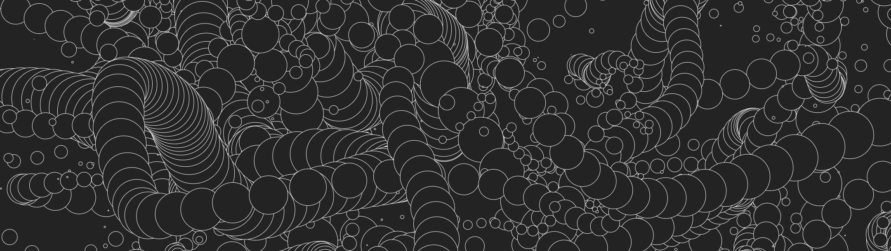

# Introducción al livecoding y al arte generativo

## Librerias:
- [Processing](https://processing.org/)
- [p5js](https://p5js.org/)
- [Sonic Pi](https://sonic-pi.net/)

## Otros entornos de livecoding:
### Audio
- [TidalCycles](https://tidalcycles.org/)
- [ORCA](https://hundredrabbits.itch.io/orca)
- [FoxDot](https://foxdot.org/)
- [SuperCollider](https://supercollider.github.io/)

### Visual
- [Hydra](https://hydra.ojack.xyz/)
- [vvvv](https://vvvv.org/)

### Otros
- [Pure Data](https://puredata.info/)
- [Max MSP](https://cycling74.com/products/max/)
- [RAVE](https://github.com/acids-ircam/RAVE)
- [Sample generator](https://github.com/Harmonai-org/sample-generator)
- [DDSP](https://magenta.tensorflow.org/ddsp)
- [DDSP-VST](https://github.com/magenta/ddsp-vst)

## Ejemplos p5js
Los ejemplos de código del taller se encuentran en la carpeta `p5js` del repositorio, puedes verlos y editarlos en línea en el [editor online](https://editor.p5js.org/skycstls/collections/u4A2R4ey6).
## Introducción
- [00 - Situar elementos](https://editor.p5js.org/skycstls/sketches/u48GZMSHg)
- [01 - Animacion lineal](https://editor.p5js.org/skycstls/sketches/81447KyKF)
- [02 - Animacion básica](https://editor.p5js.org/skycstls/sketches/pnO5pty-E)
- [03 - Animacion con osciladores](https://editor.p5js.org/skycstls/sketches/rfVd6HwBf)
- [04 - Translate, push y pop](https://editor.p5js.org/skycstls/sketches/rT8SxD2-N)
- [05 - Turtle](https://editor.p5js.org/skycstls/sketches/YLfawJbHL)
- [06 - Particulas](https://editor.p5js.org/skycstls/sketches/n4NCWtorD)
- [07 - Ciclo de vida](https://editor.p5js.org/skycstls/sketches/-hN-tRowC)

## Aleatoriedad
- [08 - Posicion aleatoria, tamaño mapeado](https://editor.p5js.org/skycstls/sketches/9ZDTm2Yr_)
- [09 - Lerp](https://editor.p5js.org/skycstls/sketches/Zg8rYFSDZ)
- [10 - Espacios de color](https://editor.p5js.org/skycstls/sketches/zcfIEA_wu)
- [11 - Paletas generativas](https://editor.p5js.org/skycstls/sketches/ULUQcHYg5)
- [12 - Random walk](https://editor.p5js.org/skycstls/sketches/hDGeXYQ7-)
- [13 - Crecimiento](https://editor.p5js.org/skycstls/sketches/kJD9eCa5H)
- [14 - Random walk mirror](https://editor.p5js.org/skycstls/sketches/70MwWVriM)
- [15 - Particulas de fuego](https://editor.p5js.org/skycstls/sketches/Vg2Bfd5s2)

## Ruido
- [16 - Random vs Noise](https://editor.p5js.org/skycstls/sketches/sF7o7Api6)
- [17 - Noise Wave](https://editor.p5js.org/skycstls/sketches/VlCf1_VUL)
- [18 - Trayectoria y tamaño](https://editor.p5js.org/skycstls/sketches/BYtI3-qHQ)
- [19 - Noise ellipse](https://editor.p5js.org/skycstls/sketches/j2FTPNC2s)
- [20 - Cyber Sigil demo](https://editor.p5js.org/skycstls/sketches/_ccv8Y3Yp)

## Imagenes
- [21 - Cargar imagenes](https://editor.p5js.org/skycstls/sketches/yQmQBGN4X)
- [22 - Scanner](https://editor.p5js.org/skycstls/sketches/4iBynuwJT)
- [23 - Brush](https://editor.p5js.org/skycstls/sketches/6-5rjJjjA)
- [24 - Collage Digital](https://editor.p5js.org/skycstls/sketches/25oWZ76uY)

## Texto
- [25 - Unicode fill](https://editor.p5js.org/skycstls/sketches/DyaiCe-9y)
- [26 - Unicode mangler](https://editor.p5js.org/skycstls/sketches/GFn8Y915W)

## Sistemas-L
- [27 - Curva de koch](https://editor.p5js.org/skycstls/sketches/Rc38JV6Ha)
- [28 - Fractal Tree](https://editor.p5js.org/skycstls/sketches/CP2g_8xZ1)
- [29 - Formas orgánicas](https://editor.p5js.org/skycstls/sketches/Od7phpujc)

## Librerias útiles
### p5js
- [p5.Capture](https://github.com/tapioca24/p5.capture) Captura tu canvas en mp4, avi, webm, gif, png, jpg, etc.
- [ml5js](https://ml5js.org/) Machine Learning para p5js
- [p5.Create](https://github.com/zachmohammed/P5.Create) Set de herramientas para crear juegos
- [p5.createLoop](https://www.npmjs.com/package/p5.createloop) Animaciones en loop usando ruido
- [p5.fab](https://github.com/machineagency/p5.fab) Crea objetos en el mundo real con cortadoras laser o impresoras 3d
- [p5.glitch](https://p5.glitch.me/) Produce errores y artefactos digitales en tus imagenes
- [p5.party](https://github.com/jbakse/p5.party) Crea un servidor local y crea sketches multiusuario
- [p5.polar](https://github.com/liz-peng/p5.Polar) Usa coordenadas polares en tu sketch
- [p5.osc](https://github.com/genekogan/p5js-osc) Conecta con Sonic Pi y otros programas que usen el protocolo OSC

# Otras herramientas
- [ImageMagick](https://imagemagick.org/index.php) Herramienta de linea de comandos para manipular imagenes
- [ffmpeg](https://ffmpeg.org/) Herramienta de linea de comandos para manipular video y audio
- [git](https://git-scm.com/) Sistema de control de versiones
- [VSCode](https://code.visualstudio.com/) Editor de texto
- [Live Server](https://marketplace.visualstudio.com/items?itemName=ritwickdey.LiveServer) Servidor local para VSCode, necesario para ejecutar sketches de p5js

# Referencias
- [TOPLAP Manifesto](https://toplap.org/wiki/ManifestoDraft)
- [The Coding Train](https://thecodingtrain.com/)